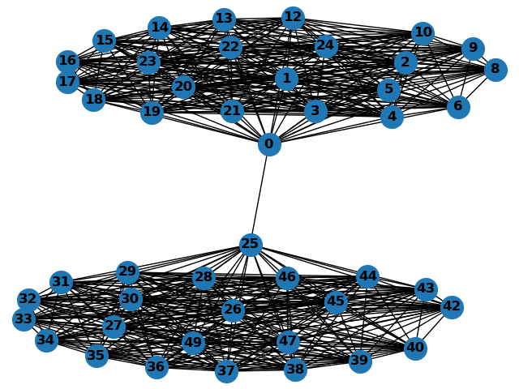

# Ultimatum-game

In this research project I simulated an ultimatum game model based on different living costs and summarized how the convergence of strategy distribution after a long time.

Here is a diagram showing how I designed the simulation.

Each agent in this model are assigned with 3 variables: portion they willing to share(θ), fairness demand(λ), and energy cache they stored(B). In each term, each agent is paired with another to interact. An offeror and a receiver is randomly assigned among each pair of agents. If offeror's θ is larger than receiver's λ, then the offeror would add 1-θ to storage and receiver would add θ, otherwise, they both receive nothing. At the same time, each agent losses κ amount of energy due to living cost.

Moreover, all agents imitate others to update their own strategies by adding a weighted difference between their strategies and strategies of agents with more stored energy.

Here are figures of θ and the λ under different living costs. "l" means lambda. "t" means theta, number above each histogram represents costs of living

Theoretically the offeror always offers as little as possible while receiver always accept the offer while in real life studies, willingness to share and fairness demand varies with regions. Clearly, graphs above favors results in real life so this simulation is very helpful to analyze ultimatum game in real life. You can find more details in [this paper](http://scripts.cac.psu.edu/users/a/l/alb18/PaperFile/arXiv2009.01970.pdf) I coedited with prof. [Christopher Griffin](http://www.personal.psu.edu/cxg286/) at Penn State University. You can also find all the python programs I wrote for this research project [here](https://github.com/yunongch/Ultimatum-game/tree/main/code)

After that, I studied a little bit about convergence of theta in two populations with a few connections

