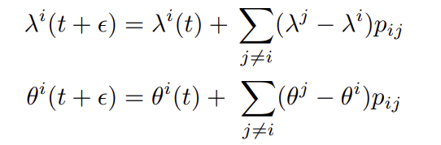
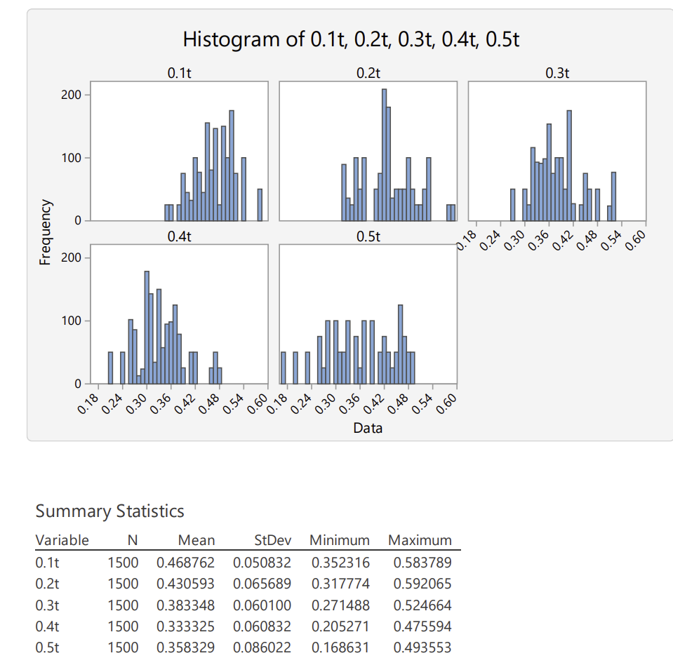

# Ultimatum-game

In this project I simulated an ultimatum game model based on different living costs and summarized how the convergence of strategy distribution after a long time.

Here is a diagram showing how I designed the simulation.

Each agent in this model are assigned with 3 variables: portion they willing to share(θ), fairness demand(λ), and energy cache they stored(B). In each term, each agent is paired with another to interact. An offeror and a receiver is randomly assigned among each pair of agents. If offeror's θ is larger than receiver's λ, then the offeror would add 1-θ to storage and receiver would add θ, otherwise, they both receive nothing. At the same time, each agent losses κ amount of energy due to living cost.

Moreover, all agents imitate others with more energy stored to update their own strategies.

Here are figures of θ and the λ under different living costs. "l" means lambda. "t" means theta, number above each histogram represents costs of living

